# System Workflow Diagrams

This document visualizes the three core operational scenarios of the Dual-LB Architecture: Normal Execution, VM Failure Recovery, and Zone Failover.

## Scenario A: Normal Task Execution
**Flow:** Dispatcher → Load Balancer → VM

This diagram illustrates the standard process of a task being submitted, scheduled via SBDLB, and executed on a VM.

---

## Scenario B: VM Failure & Auto-Recovery
**Flow:** VM Dies → LB Detects → Rescue & Restart

This diagram shows the self-healing mechanism when a VM crashes, including heartbeat monitoring, failure detection, task rescue, and VM restart.

```mermaid
sequenceDiagram
    autonumber
    participant VM as VM_5
    participant LB1 as Load Balancer 1
    participant L2 as Redis L2 (Zone 1)

    Note over VM, L2: Normal Operation
    VM->>L2: Send Heartbeat (Every 5s)
    
    Note over VM: 💥 VM CRASHES 💥
    
    Note over LB1, L2: Failure Detection
    loop Health Check (Every 3s)
        LB1->>L2: Check Last Heartbeat Timestamp
    end
    LB1->>LB1: Detect Timeout (>10s)
    LB1->>L2: Mark VM Status as DEAD

    Note over LB1, L2: Task Rescue
    LB1->>L2: Retrieve All RUNNING Tasks on VM_5
    L2-->>LB1: Return Task List (e.g., Task_101)
    LB1->>LB1: Move Task_101 to High Priority Queue

    Note over LB1, VM: Soft Recovery
    LB1->>VM: Trigger Restart Command
    LB1->>L2: Update VM Status (RESTARTING)
    
    Note over VM: ⏳ Booting up (30s delay)...
    
    VM->>L2: Send First Heartbeat (Status: ALIVE)
    Note over LB1: VM_5 added back to Available Pool
```

---

## Scenario C: Zone Failover (Critical LB Failure)
**Flow:** LB1 Dies → LB2 Takes Over Zone 1

This diagram demonstrates the high-availability failover where a healthy Load Balancer takes control of a failed zone's resources and tasks.

```mermaid
sequenceDiagram
    autonumber
    participant LB1 as LB1 (Zone 1)
    participant LB2 as LB2 (Zone 2)
    participant L1 as Redis L1 (System)
    participant L2_Z1 as Redis L2 (Zone 1)
    participant VM_Z1 as VM_5 (Zone 1)

    Note over LB1: Normal Operation
    LB1->>L1: Send Heartbeat
    
    Note over LB1: 💥 LB1 CRASHES 💥
    
    Note over LB2, L1: Peer Failure Detection
    loop Peer Health Check (Every 3s)
        LB2->>L1: Check LB1 Heartbeat
    end
    LB2->>LB2: Detect Timeout (>10s)
    
    Note over LB2, L2_Z1: Zone Takeover
    LB2->>L1: Request Zone 1 Configuration
    L1-->>LB2: Return Zone 1 L2 Cache Details
    
    LB2->>L2_Z1: Connect to Zone 1 Cache
    LB2->>L2_Z1: Retrieve Zone 1 Active VM List
    L2_Z1-->>LB2: Return VM IDs & Access Info
    
    LB2->>LB2: Merge Zone 1 VMs into Local Registry
    
    Note over LB2, L1: Task Recovery
    LB2->>L1: Retrieve LB1's QUEUED Tasks
    LB2->>LB2: Add Tasks to Scheduling Queue
    
    Note over LB2, VM_Z1: Unified Scheduling
    LB2->>VM_Z1: Query Real-Time Stats (Direct Cross-Zone)
    VM_Z1-->>LB2: Return Stats
    LB2->>VM_Z1: Send Task Payload
    Note over LB2: Zone 1 Resources now managed by LB2
```

